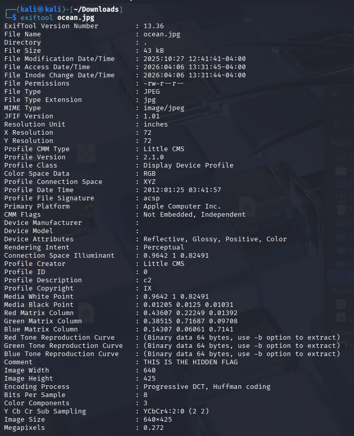

# Metadata Analysis & File Forensics WalkThrough

This repository demonstrates fundamental techniques for analyzing file metadata, extracting hidden data (steganography), and verifying file signatures using common command-line forensics tools.

## 🛠️ Tools Used

| Tool | Purpose |
|------|---------|
| `ExifTool` | Reads, writes, and edits meta information in a wide variety of files |
| `Hexeditor` | Used for inspecting the raw binary data of files |
| `Binwalk` | A tool for searching a given binary image for embedded files and executable code |
| `Strings` | Extracts printable, human-readable character sequences from binary files |
| `File` | Determines file types based on magic numbers/file signatures rather than extensions |

---

## 📂 File Walkthrough & Commands

### 1. `ocean.jpg` - Metadata Extraction
We used `ExifTool` to analyze the metadata of this JPEG.

```bash
exiftool ocean.jpg
```



* Inspecting the output revealed a hidden flag planted within the image's `Comment` field.

**Result** :

```bash
THIS IS THE HIDDEN FLAG
```

### 2. `computer.jpg` - Hex Analysis
We used `hexeditor` to analyze this image.

```bash
hexeditor computer.jpg
```


**Result** :

```bash
The image file was opened in a hex editor to inspect its raw hexadecimal and ASCII data structures
```

### 3. `dog.jpg` - Extracting Embedded Archives
We Used `Binwalk` to check if any other files were hidden within the image binary.

* Check for hidden files

  ```bash
  binwalk dog.jpg
  ```
  

  * It successfully detected the hidden ZIP archive

* Extract the hidden ZIP archive

  ```bash
  binwalk -e dog.jpg
  ```

* Go to the extracted folder and cat hidden file

  ```bash
  cd _dog.jpg.extracted/
  ls
  cat hidden_text.txt
  ```

  

  **Result** :
  
  ```bash
  THIS IS A HIDDEN FLAG
  ```

### 4. `computer.jpg` - String Extraction
We used `strings` to quickly look for readable text hidden inside the image file.

```bash
strings computer.jpg
```


**Result** : 

```bash
Extracted ICC profile information and various standard background strings embedded in the file structure
```

### 5. `solitaire.exe` - File Signature Verification
Malicious or deceptive files often hide behind spoofed extensions. We used the `file` command to check the true identity of this executable.

* Check the true file type of the executable

  ```bash
  file solitaire.exe
  ```

  

  **Result** :
  
  ```bash
  The file `solitaire.exe` was identified as `PNG image data, 640 x 449, 8-bit/color RGBA, non-interlaced`
  ```
  
* To fix the spoofed extension and view the file properly, it was renamed to its proper `.png` format and run again check the true file type of the image:

  ```bash
  mv solitaire.exe solitaire.png
  ```
  ```bash
  file solitaire.png
  ```
  
  
  
  **Result** :

  ```bash
  The file `solitaire.png` was identified as `PNG image data, 640 x 449, 8-bit/color RGBA, non-interlaced`
  ```

### 6. `rubiks.jpg` - File Signature Verification
Similarly, we checked the true file type of this image file using the file command.

* Check the true file type of the image

  ```bash
  file rubiks.jpg
  ```

  
  
  **Result** :

  ```bash
  The file `rubiks.jpg` was also identified as `PNG image data, 609 x 640, 8-bit/color RGBA, non-interlaced`
  ```
* To correct the extension, it was renamed to its proper `.png` format and run again check the true file type of the image:

  ```bash
  mv rubiks.jpg rubiks.png
  ```
  ```bash
  file rubiks.png
  ```

  
  
  **Result** :

  ```bash
  The file `rubiks.jpg` was also identified as `PNG image data, 609 x 640, 8-bit/color RGBA, non-interlaced`
  ```
